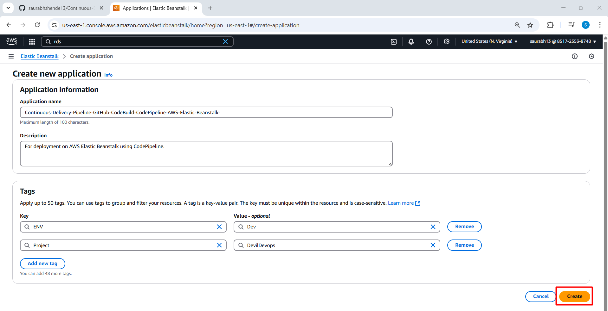
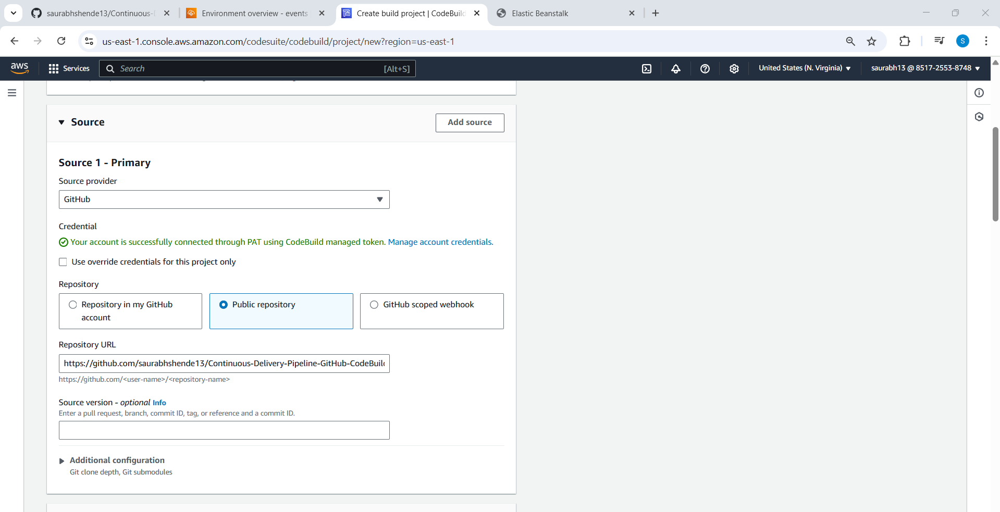
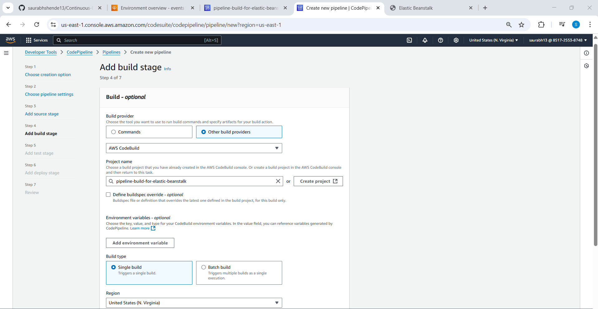
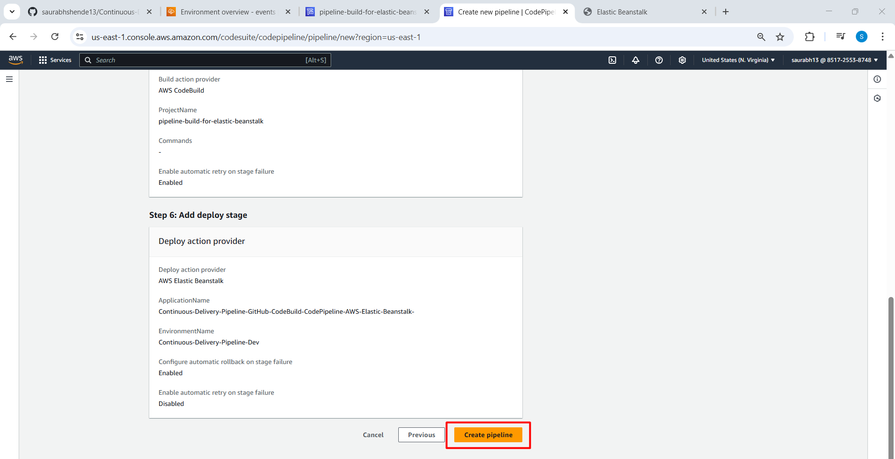
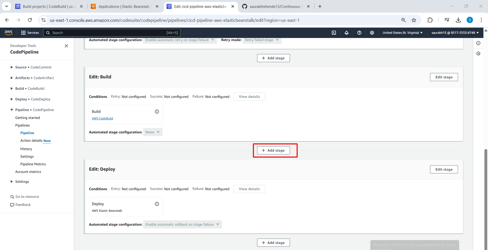
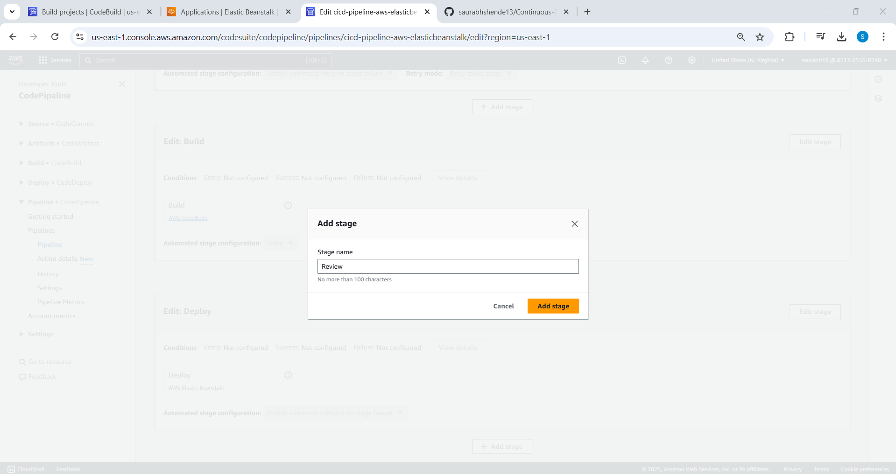
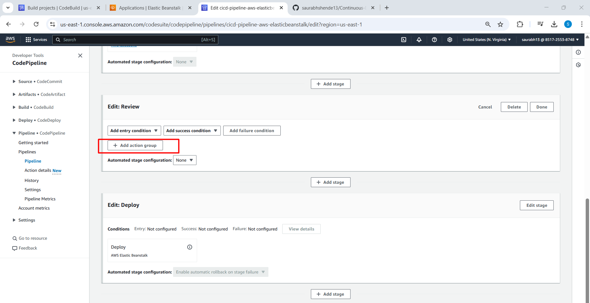
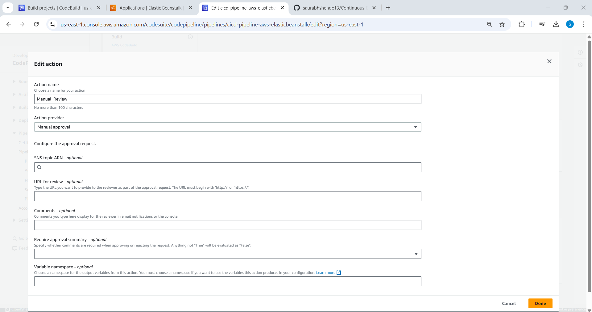
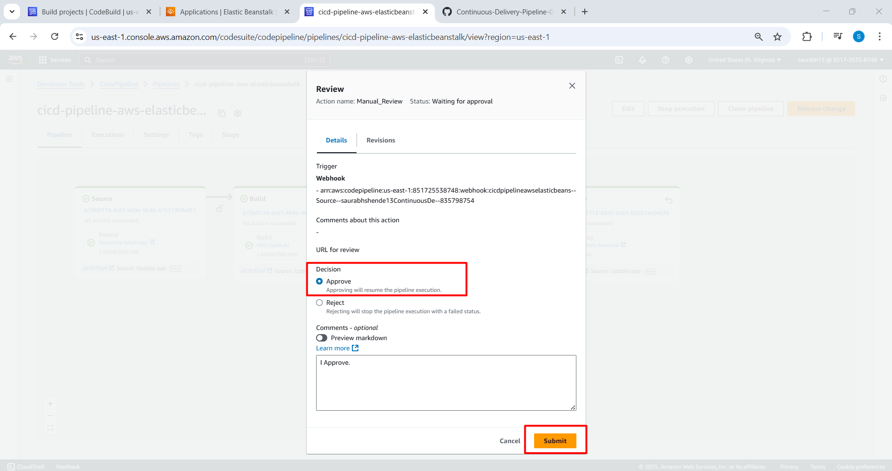
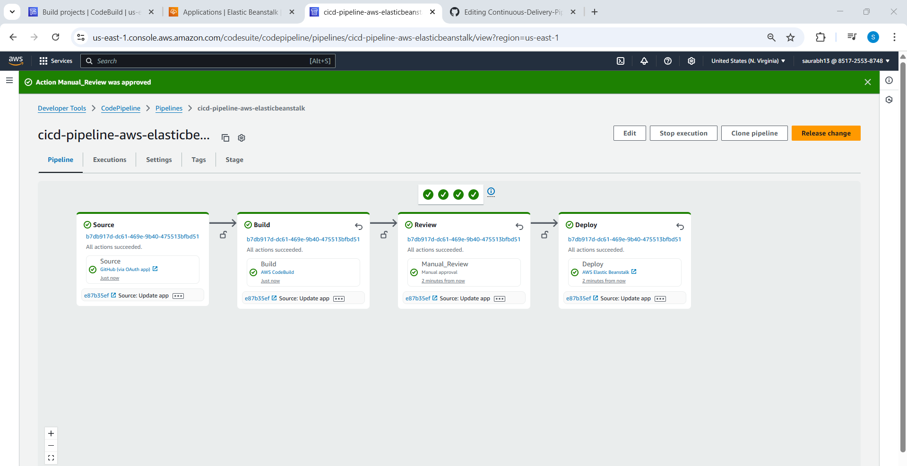

# 🚀 Continuous Delivery Pipeline with GitHub, CodeBuild, CodePipeline, and AWS Elastic Beanstalk

This project demonstrates how to implement a **Continuous Delivery (CD) Pipeline** using **AWS Elastic Beanstalk**, **AWS CodePipeline**, **AWS CodeBuild**, and **GitHub** as the source repository. The pipeline automates the process of building and deploying a sample application to Elastic Beanstalk whenever changes are pushed to the GitHub repository.

---

## 🔧 Tech Stack & AWS Services Used

- **GitHub** – Source Control
- **AWS Elastic Beanstalk** – Application Deployment
- **AWS CodeBuild** – Build and Package the App
- **AWS CodePipeline** – Continuous Delivery Pipeline
- **IAM** – Role-based Access Control

---

## 📸 Step-by-Step Implementation

### ✅ Step 1: Create a Sample App in AWS Elastic Beanstalk

1. Navigate to the **Elastic Beanstalk** service in AWS.
2. Create a new **sample application** environment (e.g., Node.js, Python, etc.).

3. Create IAM Role for AWS ElasticBeanstalk

Make sure to create and attach an **IAM Role** with appropriate permissions for the services to interact securely.

- Add permissions for:
  - `AWSElasticBeanstalkReadOnly`
  - `AWSElasticBeanstalkWebTier`
  - `AWSElasticBeanstalkWorkerTier`

4. Specify the role.

5. Click on review and Submit.

5. Verify sample app deployment.

---
---

### ✅ Step 2: Create a CodeBuild Project

1. Open **AWS CodeBuild** and create a new project.

  
2. Connect it with your GitHub repository (authorize if required).

  
3. Define the **buildspec commands** from below example.

4. Click on Create Build Project.

5. Start Build and Verify logs.

---
---

### ✅ Step 3: Create a CodePipeline Project

1. Open AWS CodePipeline and create a new pipeline.

2. Select existing or create New service role

3. Choose GitHub as the source provider and connect your repository.

4. Add the CodeBuild project as the build step.

5. Set Elastic Beanstalk as the Deploy provider and choose the environment created earlier.

6. Create Pipeline.

5. Verify Deployment.

---

---
### ✅ Step 4: Create a Stage for Manual Approval

---

---

✅ Final Outcome
Once everything is configured:

- Any code push to GitHub will trigger the CodePipeline.

- CodeBuild will install dependencies and package the app.

- Manual Approval will be required at this stage.

- CodePipeline will deploy the application to Elastic Beanstalk.

---

---

📂 Project Structure

---

---

🔐 IAM Policy Summary
Ensure the IAM roles used for CodeBuild and CodePipeline include:

AWSElasticBeanstalkReadOnly

AWSElasticBeanstalkWebTier

AWSElasticBeanstalkWorkerTier

CodePipeline execution

CodeBuild execution

---

---

🙌 Contributions & Feedback
Pull requests and suggestions are welcome. Fork it, improve it, and share back!

---

---

📬 Contact
Author: Saurabh Shende
📧 saurabhshende13@gmail.com
